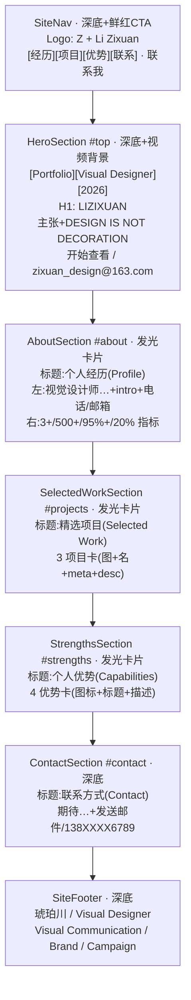

# 简单 PRD —— gerenzhan 作品集站点「逐字照搬」恢复

> 产品经理：许清楚（software-product-manager）
> 模式：简单 PRD（无竞品/市场分析）
> 硬规则：逐字照搬目标站 https://gerenzhan.pages.dev 全部可见内容；唯一例外——站主名「李梓轩」→「琥珀川」；其余一字不改（结构/格式/顺序/文案/配色均原样）。

---

## 1. 项目信息

| 项 | 值 |
|---|---|
| Language | 中文（与用户需求一致） |
| Programming Language | 沿用现有仓库：**Vite + React + 自定义 CSS**（global.css 已抓取 gerenzhan 真实令牌）。**不引入 MUI / Tailwind**，避免破坏已抓好的令牌与发光卡片。 |
| Project Name | `gerenzhan_portfolio_restore` |
| 原始需求复述 | 「利用原来所有的素材，完全照搬原内容，不做任何修改或删减。唯一例外：保留『琥珀川』相关内容不变。其余所有素材均按原始状态完整复制，保持原有的结构、格式和内容顺序不变。内容来自于网站 https://gerenzhan.pages.dev」 |

---

## 2. 产品目标

将站点从当前单板块（仅「我的爱好」）恢复为 gerenzhan 同款**完整多板块作品集**，做到：

1. **内容逐字照搬**——文案、项目名、描述、经历、优势标签、联系方式、结构、格式、顺序全部原样复制（见第 6 节内容基线）。
2. **仅一处站主名替换**——全文「李梓轩」→「琥珀川」（其余不改）。
3. **视觉沿用现有令牌**——复用 `src/styles/global.css` 中已抓好的 gerenzhan 真实配色（深底 `#050608` / 鲜红 `#ff2d1f` / 暖米白 `#f5f1e8` / 发光卡片），不重新发明。
4. **清理死素材**——删除 `public/covers/` 下无引用的旧 SVG，减小产物体积。

---

## 3. 用户故事

1. **作为站点访客**，我希望打开首页就能看到完整的个人作品集（导航 / 首屏 / 经历 / 项目 / 优势 / 联系 / 页脚），以便快速了解站主「琥珀川」的专业能力与作品。
2. **作为站主（琥珀川）**，我希望站点文案与 gerenzhan 完全一致、仅署名改为我本人，以便保留原有内容资产而不暴露原站主身份。
3. **作为维护者**，我希望板块数据集中在 `src/data/` 下、逐字可查，以便后续增删项目或文案时不必改动组件结构。

---

## 4. 需求池

### P0（必须）

- **① 恢复完整板块结构**：导航 `SiteNav` + 首屏 `HeroSection` + 个人经历 `AboutSection` + 精选项目 `SelectedWorkSection` + 个人优势 `StrengthsSection` + 联系方式 `ContactSection` + 页脚 `SiteFooter`，内容逐字照搬（见第 6 节内容基线）。当前 `App.jsx` 仅渲染 `HobbiesSection`，需改为按序渲染全部板块。
- **② 站主名替换**：全文「李梓轩」→「琥珀川」。字面「李梓轩」仅出现 **1 处**（数据 `Vu.name`，渲染于页脚「李梓轩 / Visual Designer」），仅此替换，其余一字不改。（首屏 h1「LIZIXUAN」与导航 Logo「Li Zixuan」为同一站主的**拼音形态**，是否一并替换见待确认问题①。）
- **③ 复用现有配色令牌**：各板块套用 `--ink` 深底 + `--accent` 鲜红强调 + `--paper` 暖米白文字；发光卡片沿用现有 `GlowCard.jsx`（`.glow-card` conic 发光描边）。沿用 `Reveal.jsx` 滚动入场。不引入 MUI/Tailwind。
- **④ 清理死 SVG（减小产物体积）**：删除 `public/covers/` 下无引用的文件——`anime-1..6.svg`（6）、`movie-1..6.svg`（6）、`music-1..9.svg`（9），以及未被任何组件引用的 `avatar.svg`。现有 `HobbiesSection` 使用 emoji 而非这些 SVG，且新版板块不依赖它们。
- **⑤ 板块标题用 gerenzhan 原文**：个人经历 / 精选项目 / 个人优势 / 联系方式（含英文副标 Profile / Selected Work / Capabilities / Contact）。**禁止**使用「我的兴趣」之类旧标题。

### P1（建议）

- **① 顶部 SiteNav 锚点跳转 + 滚动高亮**：导航项 `[经历][项目][优势][联系]` 跳转 `#about/#projects/#strengths/#contact`；滚动超过首屏后导航进入 floating 高亮态（gerenzhan 的 `is-floating`）。
- **② 底部 SiteFooter 署名**：渲染「琥珀川 / Visual Designer」+ location「Visual Communication / Brand / Campaign」。

### P2（可选）

- **① 滚动进度条 / post-hero 背景**：gerenzhan 在首屏后有一段 `post-hero-bg`（grainient 流光背景），可选择性恢复。
- **② 纯深色，无主题切换**：gerenzhan 为纯深色，已移除明暗切换；保持现状即可。

---

## 5. UI 设计稿（整页从上到下）

### 5.1 板块顺序与视觉令牌（mermaid）

### 5.2 各板块核心元素与令牌标注

| 顺序 | 板块（原文标题） | 核心元素 | 视觉令牌 |
|---|---|---|---|
| 1 | SiteNav（导航） | Logo「Z」+「Li Zixuan」；锚点 `[经历][项目][优势][联系]`；CTA「联系我」 | 深底 `--ink` + 鲜红 CTA `--accent` + 暖米白文字 |
| 2 | HeroSection（首屏） | 视频背景；标签 `[Portfolio][Visual Designer][2026]`；H1「LIZIXUAN」；主张 + 大标语；按钮 | 深底 + 视频背景 + 鲜红强调 + 暖米白 H1 |
| 3 | 个人经历（Profile） | 左：发光卡片（h2+intro+电话/邮箱）；右：4 项滚动数字指标 | 发光卡片 `.glow-card` + 深底表面 + 暖米白 |
| 4 | 精选项目（Selected Work） | 3 张项目卡：序号+标题+meta+描述+配图 | 发光卡片 + 深底 + 鲜红序号/标签 |
| 5 | 个人优势（Capabilities） | 4 张优势卡：图标+标题+描述 | 发光卡片 + 深底 + 鲜红图标 |
| 6 | 联系方式（Contact） | 大标题 + 发送邮件 / 电话按钮 | 深底 + 鲜红主按钮 |
| 7 | SiteFooter（页脚） | 「琥珀川 / Visual Designer」+ location | 深底 + 静音/暖米白文字 |

> 板块标题文字严格使用 gerenzhan 原文（见第 6 节），不出现「我的兴趣」。

---

## 6. 内容基线（附件 · 逐字，按渲染从上到下）

> 来源：目标站 JS bundle `index-t81xRDPf.js` 实测提取。**所有文案逐字**，仅在标注处将「李梓轩」→「琥珀川」。

### 6.1 导航 SiteNav
- 品牌：`Z`（字母 Mark）+ `Li Zixuan`（小字副标）
- 锚点（带方括号）：`[经历]`→#about、`[项目]`→#projects、`[优势]`→#strengths、`[联系]`→#contact
- CTA：`联系我`（邮件图标，mailto:`zixuan_design@163.com`）

### 6.2 Hero 首屏（#top）
- 背景视频：`/assets/hero-background-BsvG8_zp.mp4`（自动播放/静音/循环）+ 降级层 + 颗粒层
- 标签行：`[Portfolio]` `[Visual Designer]` `[2026]`
- 主标题 H1：`LIZIXUAN`
- 指标：`500+` + `Visual systems & commercial assets delivered yearly`
- 主张段落：`以品牌秩序与商业审美，构建可落地的视觉系统。`
- 大标语：`DESIGN` ` IS NOT` ` ` `DECORATION`
- 主按钮：`开始查看`（→#projects）
- 次按钮：`zixuan_design@163.com`（mailto）
- 滚动提示：`滚动到个人经历`（→#about）

### 6.3 个人经历（Profile / #about）
- 模块标题：en `Profile` / cn `个人经历`
- 左卡片（发光卡片）：
  - H2：`视觉设计师，擅长把需求整理成清晰、可执行的视觉结果。`
  - 段落：`拥有 3 年专业视觉设计经验，覆盖品牌 VI、平面宣传、电商视觉、新媒体视觉与包装设计。擅长将品牌调性、用户审美与市场需求转译为稳定、高质感、可执行的视觉方案。`
  - 联系行：电话 `138XXXX6789`（tel:）、邮箱 `zixuan_design@163.com`（mailto:）
- 右指标（4 项，数字滚动动画）：
  - `3+` `年全职经验`
  - `500+` `年均落地作品`
  - `95%+` `客户满意度`
  - `20%+` `活动点击提升`

### 6.4 精选项目（Selected Work / #projects）
- 模块标题：en `Selected Work` / cn `精选项目`
- 副文案：`先以高级占位图建立展示节奏，后续可替换为品牌 VI、商业海报、电商详情页、包装设计等真实作品。`
- 项目卡片（3 张，含配图）：
  1. `品牌 VI 视觉升级` ｜ meta：`2023.04 - 2023.06 / 视觉主设计师` ｜ desc：`完成品牌色彩体系、字体规范、LOGO 延展、图标系统与全渠道视觉规范，推动品牌形象年轻化与标准化。` ｜ 图：`/assets/pin-231794-01-IJ03r-7v.jpg`（crop: left center）
  2. `全年节日营销视觉全案` ｜ meta：`2022.08 - 至今 / 视觉设计师` ｜ desc：`围绕电商大促、节日节点与品牌专场，输出活动首页、海报、详情页、引流配图与短视频封面。` ｜ 图：`/assets/pin-691634-02-BU7kYcyN.jpg`（crop: center center）
  3. `电商店铺视觉优化` ｜ meta：`首页改版 / 详情页 / 主图精修` ｜ desc：`优化页面视觉层级与浏览路径，提升商品呈现质感，并为运营活动提供稳定视觉支撑。` ｜ 图：`/assets/pin-438680-03-D8WGZ1f4.jpg`（crop: right center）

### 6.5 个人优势（Capabilities / #strengths）
- 模块标题：en `Capabilities` / cn `个人优势`
- 优势卡片（4 张）：
  - `商业设计思维` — `不止于审美表达，更关注营销目标、平台规范与最终落地效果。`
  - `品牌视觉系统` — `熟悉 VI 规范、品牌延展、视觉资产沉淀与多渠道一致性管理。`
  - `高效协作交付` — `可独立完成需求拆解、方案构思、修改优化与跨部门沟通。`
  - `趋势与风格迭代` — `持续跟进设计趋势，能适配互联网、电商、文创与品牌营销场景。`

### 6.6 联系方式（Contact / #contact）
- 模块标题：en `Contact` / cn `联系方式`
- 大标题：`期待与品牌、产品和市场团队一起，把视觉做得更有辨识度。`
- 主按钮：`发送邮件`（邮件图标，mailto:`zixuan_design@163.com`）
- 次按钮：`138XXXX6789`（电话图标，tel:）

### 6.7 页脚 SiteFooter
- `李梓轩 / Visual Designer`  ← **【此处「李梓轩」替换为「琥珀川」，即「琥珀川 / Visual Designer」】**
- `Visual Communication / Brand / Campaign`

### 6.8 「李梓轩」替换标注（关键）
- **字面出现位置：仅 1 处** → 数据 `Vu.name = "李梓轩"`，渲染于页脚 `李梓轩 / Visual Designer`。替换后全站仅此一处中文站主名变为「琥珀川」。
- **拼音形态（非字面「李梓轩」，但为同一站主身份）**：首屏 H1 `LIZIXUAN`、导航 Logo 副标 `Li Zixuan`。是否一并替换见待确认问题①。
- 站内无独立 `<title>` 含站主名，无需处理文档标题。

### 6.9 资产引用清单（gerenzhan `/assets/`，需随内容一并保留）
- 视频：`/assets/hero-background-BsvG8_zp.mp4`
- 项目图：`/assets/pin-231794-01-IJ03r-7v.jpg`、`/assets/pin-691634-02-BU7kYcyN.jpg`、`/assets/pin-438680-03-D8WGZ1f4.jpg`

---

## 7. 待确认问题

1. **站主名替换范围（最高优先）**：字面「李梓轩」仅 1 处（页脚）。但首屏 H1「LIZIXUAN」与导航 Logo「Li Zixuan」是「李梓轩」的拼音形态。按**字面规则**仅改页脚为「琥珀川 / Visual Designer」；若按**“站主身份整体替换”意图**，需同步将 `LIZIXUAN`→`琥珀川`（或 `HUBOCHUAN`）、`Li Zixuan`→`琥珀川`（或 `Hu Bochuan`）。请确认采用哪种。
2. **项目配图 / Hero 视频素材来源**：gerenzhan 使用远程 `/assets/pin-*.jpg` 与 `/assets/hero-background-*.mp4`。逐字照搬是否**直接引用这些远程 URL**，还是**下载到本地 `public/`**？影响产物自包含与离线可用性，请确认。

---

## 8. 文件映射提示（供架构师/工程师）

| gerenzhan 板块 | 我们组件 | 数据文件（src/data/，逐字照搬） |
|---|---|---|
| 导航 | `SiteNav`（新建/复用） | `nav.js`（4 锚点）、`profile.js`（email） |
| 首屏 | `HeroSection`（新建） | `profile.js`（headline 等）、`metrics.js`（4 指标） |
| 个人经历 | `AboutSection`（新建） | `profile.js`（name/role/intro/phone/email/location） |
| 精选项目 | `SelectedWorkSection`（由 `HobbiesSection` 改造或新建） | `projects.js`（3 项目） |
| 个人优势 | `StrengthsSection`（新建） | `capabilities.js`（4 优势） |
| 联系方式 | `ContactSection`（新建） | `contact.js`（文案/邮箱/电话） |
| 页脚 | `SiteFooter`（新建） | `profile.js`（name/role/location） |

- 可复用现有组件：`GlowCard.jsx`（发光卡片）、`Reveal.jsx`（滚动入场）、`AppIcon.jsx`（图标）。
- `App.jsx` 改为按第 5.1 节顺序渲染全部板块。
- 旧 `HobbiesSection.jsx` 改造为 `SelectedWorkSection` 或弃用；其封面 SVG 在 P0④ 清理。
- 配色令牌已就绪于 `src/styles/global.css`，无需新增。
