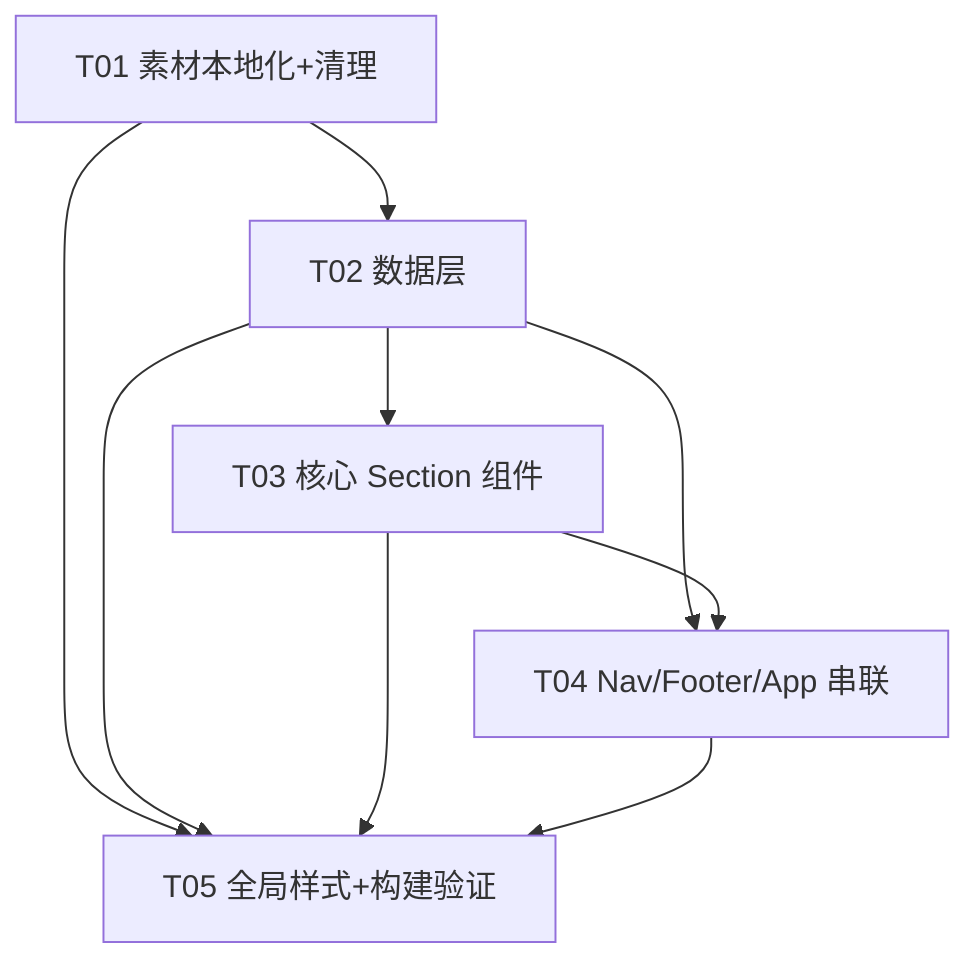

# gerenzhan 作品集站点恢复 —— 系统架构设计 + 任务分解

> **架构师**：高见远（software-architect）
> **输入**：`PRD_gerenzhan.md`（产品经理 许清楚）+ 主理人两项拍板决议
> **技术栈**：Vite + React 18 + 自定义 CSS（global.css 已含 gerenzhan 真实令牌）
> **交付**：架构设计 + 有序任务分解（可直接交工程师执行）

---

## 0. 主理人已拍板决议（最高优先，全篇照此落地）

1. **站主名 = 全站身份整体替换（非仅页脚）**：凡出现原站主身份处统一为「琥珀川」。
   - 页脚 `李梓轩 / Visual Designer` → `琥珀川 / Visual Designer`
   - 首屏 H1 `LIZIXUAN` → `琥珀川`（用中文，不用拼音）
   - 导航 Logo 副标 `Li Zixuan` → `琥珀川`
   - **其余所有文案逐字照搬 gerenzhan，一字不改**（项目名、描述、经历、优势标签、联系方式、结构、格式、顺序均原样）。
2. **素材本地化（不热链 gerenzhan 域名）**：Hero 背景视频 + 3 张项目图下载到本地 `public/assets/`，保证在 GH Pages（`/blog/` base）与 CF（`/` base）均自包含可用。
   - 下载前已用 `curl -sI` 验证 4 个 URL 均为 `HTTP 200`，content-type 正确（`video/mp4`、`image/jpeg`），**无需降级**。
   - 真实文件名与落盘名映射见 §2 文件列表与 §7 T01。

---

## 1. 实现方案（Implementation Approach）

### 1.1 核心难点
| 难点 | 说明 | 应对 |
|---|---|---|
| 多板块逐字恢复 | 7 板块结构与文案原样复制，仅站主名替换 | 文案集中在 `src/data/*`，组件纯展示，避免文案散落 |
| 素材本地化 + base 感知 | 子路径部署（`/blog/`）下 `public/` 资源须拼接 BASE_URL | 复用 `src/utils.js` 的 `asset()`（`import.meta.env.BASE_URL`） |
| 发光卡片复用 | 沿用 `.glow-card` cursor 跟随 conic 发光描边 | 直接复用 `GlowCard.jsx`，不重写 |
| 导航 floating 高亮 | 滚过首屏后进入 floating 态（gerenzhan `is-floating`） | `SiteNav` 内 `onScroll` + `useState` 切 class |
| 数字滚动动画 | About 4 个指标滚动计数 | `IntersectionObserver`（复用 Reveal 思路）+ `requestAnimationFrame` 自实现，不引库 |
| 无后端 / 无状态库 | 纯静态展示站 | 数据全静态，组件 props/import 读取即可 |

### 1.2 框架与库选型
- **构建**：Vite 5 + `@vitejs/plugin-react` 4（已有，零改动）。
- **UI**：React 18 函数组件 + 自定义 CSS。**不引入 MUI / Tailwind**（避免破坏已抓令牌与发光卡片）。
- **图标**：复用 `AppIcon.jsx`（inline SVG，零依赖）；为 ContactSection 新增 `phone` 图标（T04 改动）。
- **动画**：原生 CSS（`transform/opacity`，GPU 友好）+ `IntersectionObserver`/`requestAnimationFrame`，不引动画库。
- **视频/图片**：原生 `<video>` / ``，资源经 `asset()` 引用，不引媒体库。
- **router**：无需（单页锚点滚动）。

### 1.3 架构模式
单页静态站点 + **数据驱动组件化**：`src/data/*` 为数据层（逐字内容），`src/components/*` 为视图层（纯展示 + 轻微交互），`App.jsx` 为组合根按 §2 顺序渲染 7 板块。无 Controller / 无后端（MVC 的 V 层 + 静态数据层）。

---

## 2. 文件列表（含相对路径与操作）

### 2.1 新建文件
| 路径 | 说明 |
|---|---|
| `src/components/SiteNav.jsx` | 顶部导航：Logo（琥珀川）+ 锚点 [经历][项目][优势][联系] + CTA 联系我；滚动 floating 高亮 |
| `src/components/HeroSection.jsx` | 首屏 #top：视频背景 + 标签 + H1「琥珀川」+ 主张 + 大标语 + 双按钮 |
| `src/components/AboutSection.jsx` | 个人经历 #about：左发光卡片（H2/intro/电话邮箱）+ 右 4 指标数字滚动 |
| `src/components/SelectedWorkSection.jsx` | 精选项目 #projects：3 张项目卡（图+序号+标题+meta+desc） |
| `src/components/StrengthsSection.jsx` | 个人优势 #strengths：4 张优势卡（图标+标题+描述） |
| `src/components/ContactSection.jsx` | 联系方式 #contact：大标题 + 发送邮件/电话按钮 |
| `src/components/SiteFooter.jsx` | 页脚：琥珀川 / Visual Designer + location |
| `src/data/profile.js` | 站主身份 + 个人经历 + 4 指标 + Hero 段落文案（逐字） |
| `src/data/projects.js` | 3 个项目（逐字） |
| `src/data/capabilities.js` | 4 个优势（逐字） |
| `src/data/contact.js` | 联系方式文案 / email / phone（逐字） |
| `src/data/nav.js` | 导航锚点 + Logo 文案（琥珀川） |
| `public/assets/hero-background.mp4` | 下载自 `…/hero-background-BsvG8_zp.mp4`（video/mp4，已验证 200） |
| `public/assets/project-01.jpg` | 下载自 `…/pin-231794-01-IJ03r-7v.jpg`（已验证 200） |
| `public/assets/project-02.jpg` | 下载自 `…/pin-691634-02-BU7kYcyN.jpg`（已验证 200） |
| `public/assets/project-03.jpg` | 下载自 `…/pin-438680-03-D8WGZ1f4.jpg`（已验证 200） |

### 2.2 修改文件
| 路径 | 改动点 |
|---|---|
| `src/App.jsx` | 由「仅渲染 HobbiesSection」改为按序渲染 7 板块（见 §2.4 顺序） |
| `src/components/AppIcon.jsx` | 新增 `phone` 图标 path（ContactSection 电话按钮用） |
| `src/styles/global.css` | 新增 nav/hero/about/selectedwork/strengths/contact/footer 样式；**删除** `.hobby-*` / `.douban-badge` 死类；保留 `.glow-card`/`.reveal` |
| `index.html` | 更新 `<title>`/`<description>` 为作品集口径（见 §5 待明确事项②） |

### 2.3 删除文件
| 路径 | 原因 |
|---|---|
| `src/components/HobbiesSection.jsx` | 被 SelectedWorkSection 取代 |
| `src/data/hobbies.js` | 旧「我的爱好」数据，不再需要 |
| `public/covers/anime-1.svg` … `anime-6.svg`（6） | 死 SVG，无引用 |
| `public/covers/movie-1.svg` … `movie-6.svg`（6） | 死 SVG，无引用 |
| `public/covers/music-1.svg` … `music-9.svg`（9） | 死 SVG，无引用 |
| `public/covers/avatar.svg`（1） | 死 SVG，无引用 |
| **合计** | 删除 22 个 SVG + 2 个源码文件 |

### 2.4 保留文件（不动）
`src/main.jsx`、`src/utils.js`（保留 `asset()`；`doubanSearch` 成为孤儿函数但无害，可选清理）、`vite.config.js`、`package.json`、`public/favicon.svg`、`public/.nojekyll`、`.github/`（GH Pages CI）、`src/hooks/`（空目录，未使用）。

### 2.5 板块结构与顺序（自上而下）
```
SiteNav(导航) → HeroSection(#top) → AboutSection(#about) →
SelectedWorkSection(#projects) → StrengthsSection(#strengths) →
ContactSection(#contact) → SiteFooter(页脚)
```
各 section 设 `id` 供锚点跳转；CSS 加 `scroll-margin-top` 避免被固定导航遮挡。

---

## 3. 数据结构与接口（Mermaid classDiagram）

> 说明：数据层为静态导出（`export const`）；`..>` 表示组件对数据/复用组件的依赖；`*--` 表示组合。

```mermaid
classDiagram
    %% ============ 数据层（逐字照搬 PRD §6） ============
    class Profile {
        +String name = "琥珀川"
        +String role = "Visual Designer"
        +String intro
        +String phone = "138XXXX6789"
        +String email = "zixuan_design@163.com"
        +String location
        +Metric[] metrics
        +Hero hero
    }
    class Metric {
        +String value  %% "3+"/"500+"/"95%+"/"20%+"
        +String label
    }
    class Hero {
        +String[] tags    %% [Portfolio][Visual Designer][2026]
        +String headline = "琥珀川"
        +String statValue = "500+"
        +String statLabel = "Visual systems & commercial assets delivered yearly"
        +String claim     %% 品牌秩序与商业审美…
        +String[] slogan  %% ["DESIGN"," IS NOT","DECORATION"]
        +Object primaryCta   %% {label:"开始查看", href:"#projects"}
        +Object secondaryCta %% {label:email, href:"mailto:…"}
        +Object scrollHint   %% {label:"滚动到个人经历", href:"#about"}
    }
    class Project {
        +Number id
        +String title
        +String meta
        +String desc
        +String img   %% asset('assets/project-0X.jpg')
        +String crop  %% left center / center center / right center
    }
    class Capability {
        +Number id
        +String title
        +String desc
    }
    class Contact {
        +String heading  %% 期待与品牌…
        +String email
        +String phone
    }
    class NavLink {
        +String label
        +String href
    }
    class Nav {
        +String mark = "琥"   %% monogram，见§5①
        +String brand = "琥珀川"
        +NavLink[] links
        +Object cta  %% {label:"联系我", href:"mailto:zixuan_design@163.com"}
    }

    Profile "1" *-- "4" Metric : metrics
    Profile "1" *-- "1" Hero : hero
    Nav "1" *-- "4" NavLink : links

    %% ============ 复用组件 ============
    class GlowCard {
        +render(children)
        +onMove()  %% cursor 跟随 conic 发光描边
    }
    class Reveal {
        +render(children)  %% IntersectionObserver 入场
    }
    class AppIcon {
        +render(name)
        +phone()  %% T04 新增
    }

    %% ============ 业务 Section ============
    class SiteNav {
        +useState isFloating
        +onScroll()
        +render()
    }
    class HeroSection {
        +render()
    }
    class AboutSection {
        +useCountUp()
        +render()
    }
    class SelectedWorkSection {
        +render()
    }
    class StrengthsSection {
        +render()
    }
    class ContactSection {
        +render()
    }
    class SiteFooter {
        +render()
    }
    class App {
        +render()  %% 按序组合 7 板块
    }

    %% ============ 依赖关系 ============
    HeroSection ..> Profile : 读 hero/email
    HeroSection ..> GlowCard : 标签/按钮容器
    AboutSection ..> Profile : 读 intro/metrics
    AboutSection ..> Reveal : 入场
    SelectedWorkSection ..> Project : 遍历渲染
    SelectedWorkSection ..> GlowCard : 卡片
    StrengthsSection ..> Capability : 遍历渲染
    StrengthsSection ..> GlowCard : 卡片
    StrengthsSection ..> AppIcon : 图标
    ContactSection ..> Contact : 读 heading/email/phone
    ContactSection ..> AppIcon : mail/phone
    SiteFooter ..> Profile : 读 name/role/location
    SiteNav ..> Nav : 读 links/cta/brand
    SiteNav ..> AppIcon : mail
    App ..> SiteNav
    App ..> HeroSection
    App ..> AboutSection
    App ..> SelectedWorkSection
    App ..> StrengthsSection
    App ..> ContactSection
    App ..> SiteFooter
```

### 3.1 关键数据字段（逐字基线，供工程师填值）
- **profile.metrics**：`[{value:"3+",label:"年全职经验"},{value:"500+",label:"年均落地作品"},{value:"95%+",label:"客户满意度"},{value:"20%+",label:"活动点击提升"}]`
- **projects（3 条，逐字）**：见 `PRD_gerenzhan.md §6.4`，`img` 分别映射 `asset('assets/project-01.jpg'/'02'/'03.jpg')`，`crop` 依次为 `left center` / `center center` / `right center`。
- **capabilities（4 条）**：见 `PRD_gerenzhan.md §6.5`（商业设计思维 / 品牌视觉系统 / 高效协作交付 / 趋势与风格迭代）。
- **contact**：`heading="期待与品牌、产品和市场团队一起，把视觉做得更有辨识度。"`，`email="zixuan_design@163.com"`，`phone="138XXXX6789"`。
- **nav.links**：`[{label:"经历",href:"#about"},{label:"项目",href:"#projects"},{label:"优势",href:"#strengths"},{label:"联系",href:"#contact"}]`，`cta={label:"联系我",href:"mailto:zixuan_design@163.com"}`。

---

## 4. 程序调用流程（Mermaid sequenceDiagram）

```mermaid
sequenceDiagram
    autonumber
    actor User
    participant App as App
    participant Nav as SiteNav
    participant Hero as HeroSection
    participant About as AboutSection
    participant Work as SelectedWorkSection
    participant Str as StrengthsSection
    participant Contact as ContactSection
    participant Footer as SiteFooter
    participant Asset as utils.asset()

    Note over App: 首屏加载（初始化全站，无后端/无 CRUD）
    App->>Nav: render(brand=琥珀川, links[4], cta)
    App->>Hero: render(Profile.hero, Profile.email)
    Hero->>Asset: asset('assets/hero-background.mp4')
    Asset-->>Hero: /blog/assets/hero-background.mp4 (BASE_URL 拼接)
    App->>About: render(Profile.intro, Profile.metrics[4])
    App->>Work: render(projects[3])
    Work->>Asset: asset('assets/project-0X.jpg') ×3
    Asset-->>Work: base 感知图片 URL
    App->>Str: render(capabilities[4])
    App->>Contact: render(Contact)
    App->>Footer: render(Profile.name/role/location)

    Note over User,Nav: 交互①：导航锚点跳转
    User->>Nav: 点击 [项目]
    Nav->>Nav: e.preventDefault(); document.querySelector('#projects').scrollIntoView()
    Note right of Nav: scroll-behavior:smooth + CSS scroll-margin-top

    Note over User,Nav: 交互②：滚动 floating 高亮
    User->>Nav: 滚动超过首屏阈值
    Nav->>Nav: onScroll → setIsFloating(true) → 加 .is-floating

    Note over About: 交互③：数字滚动入场
    About->>About: IntersectionObserver 触发 → requestAnimationFrame 计数至 3+/500+/95%+/20%+
```

> 说明：本站点为纯静态展示，无创建/更新/删除后端操作；`sequenceDiagram` 覆盖「初始化全站渲染」+「三类关键交互」。

---

## 5. 待明确事项（UNCLEAR）

1. **导航 Logo monogram（字母 Mark）**：PRD §6.1 原 logo 为字母 `Z`（源自 Zixuan）。决议把 `Li Zixuan` 文案换成「琥珀川」，但 `Z` 字母 Mark 是否保留未明说。本设计**默认改为「琥」**（与全站身份一致），如需保留 `Z` 仅 T04 一处改动。
2. **`index.html` 的 `<title>`/`<description>`**：gerenzhan 原文 head 文案未抓取，PRD §6.8 称「站内无独立 `<title>` 含站主名」。现状为「我的兴趣 · 琥珀川」（旧爱好主题，与新站调性不符）。**建议改为** `琥珀川 · Visual Designer` 与作品集描述；若要求严格「逐字 gerenzhan」则保留现状。→ 待主理人确认口径（T02/T05 会按结果落）。
3. **Hero 视频下载兜底**：已 `curl -sI` 验证 4 资源均 `200`，正常无需降级；极端情况下若执行下载失败，HeroSection 应渲染 `.hero-fallback`（CSS 径向渐变 + grain 层）而非报错。
4. **`utils.js` 的 `doubanSearch`**：删除 `hobbies.js` 后成为孤儿函数，保留无害；如需整洁可在 T05 一并删除（不影响构建）。
5. **`src/hooks/` 空目录**：未使用，保留不删。
6. **保留资源确认**：`public/favicon.svg`、`public/.nojekyll`、`.github/` 均保留（PRD 待明确事项所问的 favicon 在 `public/` 根，非 `covers/`）。

---

## 6. 依赖包列表（Required Packages）

**无需新增任何第三方包。**

```
- react@^18.3.1           // 已有：UI 框架
- react-dom@^18.3.1       // 已有：DOM 渲染
- vite@^5.2.11            // 已有：构建
- @vitejs/plugin-react@^4.3.1  // 已有：React 插件
```
> 媒体（`<video>`/``）、图标（inline SVG）、数字滚动（IntersectionObserver + rAF）均零依赖实现。

---

## 7. 任务列表（有序、含依赖，≤5 模块级任务）

> 说明：依架构分解最佳实践，将主理人示例的 8 步收敛为 **5 个模块级任务**（满足 ≤5 上限、每任务 ≥3 文件、首任务为资源/基础设施基础层），顺序与依赖完整保留，可直接交工程师执行。

### T01 — 素材本地化与废弃资源清理（基础层）　`P0`
- **Source Files**：
  - 新建：`public/assets/hero-background.mp4`、`public/assets/project-01.jpg`、`public/assets/project-02.jpg`、`public/assets/project-03.jpg`
  - 删除：`public/covers/*.svg`（22 个）、`src/data/hobbies.js`、`src/components/HobbiesSection.jsx`
  - 修改：`index.html`（按 §5② 更新 `<title>`/`<description>`）
- **执行要点**：
  - 下载（已验证 200）：`curl -L <gerenzhan URL> -o public/assets/<本地名>`，4 个映射见 §2.1。
  - `rm -rf public/covers` 整体删除死 SVG。
- **Dependencies**：无
- **Priority**：P0

### T02 — 数据层（逐字照搬 PRD §6）　`P0`
- **Source Files**：
  - 新建：`src/data/profile.js`、`src/data/projects.js`、`src/data/capabilities.js`、`src/data/contact.js`、`src/data/nav.js`
- **执行要点**：5 个文件内容严格逐字 PRD §6（`profile.js` 含 `name="琥珀川"`、`hero` 段落；`nav.js` `brand="琥珀川"`；其余文案一字不改）。字段结构见 §3.1。
- **Dependencies**：T01（清理 hobbies 后写入，避免并行冲突）
- **Priority**：P0

### T03 — 核心 Section 业务组件　`P0`
- **Source Files**：
  - 新建：`src/components/HeroSection.jsx`、`src/components/AboutSection.jsx`、`src/components/SelectedWorkSection.jsx`、`src/components/StrengthsSection.jsx`、`src/components/ContactSection.jsx`
- **执行要点**：5 个组件从 T02 数据读取并渲染；复用 `GlowCard`/`Reveal`/`AppIcon`；Hero 用 `asset('assets/hero-background.mp4')`；About 数字滚动自实现；所有文案来自 `src/data/*`，组件不内联。
- **Dependencies**：T02
- **Priority**：P0

### T04 — SiteNav + SiteFooter + AppIcon 扩图标 + App 串联　`P0`
- **Source Files**：
  - 新建：`src/components/SiteNav.jsx`、`src/components/SiteFooter.jsx`
  - 修改：`src/components/AppIcon.jsx`（新增 `phone` 图标）、`src/App.jsx`（按 §2.5 顺序渲染 7 板块）
- **执行要点**：`SiteNav` 锚点跳转 + `onScroll` floating 高亮；`SiteFooter` 渲染「琥珀川 / Visual Designer」+ location；`App.jsx` 组合全部板块。
- **Dependencies**：T02、T03
- **Priority**：P0

### T05 — 全局样式新增 + 构建验证　`P0`
- **Source Files**：
  - 修改：`src/styles/global.css`（新增 nav/hero/about/selectedwork/strengths/contact/footer 样式；删除 `.hobby-*`/`.douban-badge` 死类；保留 `.glow-card`/`.reveal`；各 section 加 `scroll-margin-top`）、`package.json`/`vite.config.js`（确认无需改）
  - 验证：`npm run build`（产出 `dist/`，人工核对无 404、资源经 `asset()` 正确拼接；可选清理 `utils.js` 的 `doubanSearch`）
- **执行要点**：全部样式复用既有令牌（`--accent`/`--bgColor`/`--surfaceColor`/`--textColor` 等）；构建后 `npm run preview` 检查 `/blog/` base 下图片/视频不 404。
- **Dependencies**：T01、T02、T03、T04（类名为本设计已定，可部分前置；构建验证须全部就位）
- **Priority**：P0

---

## 8. 共享知识（Shared Knowledge）

- **资源引用一律走 `src/utils.js` 的 `asset(path)`**（内部用 `import.meta.env.BASE_URL`）。用法：``、`<video src={asset('assets/hero-background.mp4')} />`。**禁止**硬编码 `/assets/...` 或热链 `https://gerenzhan...`。
- **BASE_URL 三态**：dev `/`、CF `/`、GH Pages `/blog/`（CI 经 `--base` 传入 vite）。`public/` 文件构建时原样拷到 `dist` 根，必须经 `asset()` 拼接才能在子路径下加载。
- **锚点滚动**：HTML 已 `scroll-behavior:smooth`；各 section 设 `id`（`#top/#about/#projects/#strengths/#contact`），CSS 统一加 `scroll-margin-top`（≈导航高度）避免被固定导航遮挡。
- **站主名统一**：全站身份处 = 琥珀川（Logo「琥珀川」/ Hero H1「琥珀川」/ 页脚「琥珀川 / Visual Designer」）。其余文案逐字 gerenzhan。
- **图标**：`AppIcon` 现有 github/mail/bilibili/weibo/twitter/link/sun/moon/pin；`ContactSection` 需 `phone`，T04 在 `AppIcon.jsx` 增加 `phone` path。
- **数字滚动**：`AboutSection` 用 `IntersectionObserver`（复用 Reveal 思路）+ `requestAnimationFrame` 自实现，不引库。
- **视频兜底**：若 `asset('assets/hero-background.mp4')` 加载失败，HeroSection 渲染 `.hero-fallback`（CSS 径向渐变 + grain），不报错。
- **文案集中**：所有可见文案放 `src/data/*`，组件不内联，便于后续维护/替换。
- **发光卡片**：直接复用 `GlowCard`（含 cursor 跟随 conic 发光描边 + reveal 入场），`StrengthsSection`/`SelectedWorkSection`/`AboutSection` 左卡均用 `<GlowCard as="div">`。

---

## 9. 任务依赖图（Mermaid graph）


