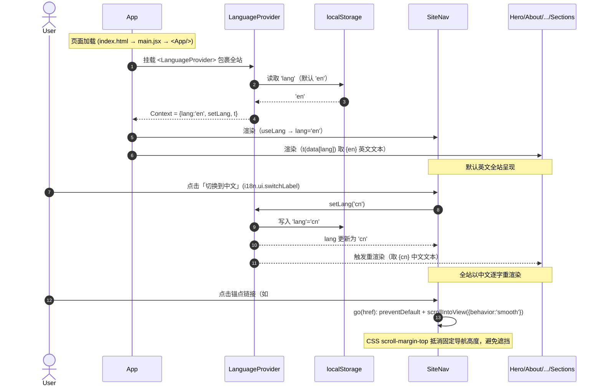
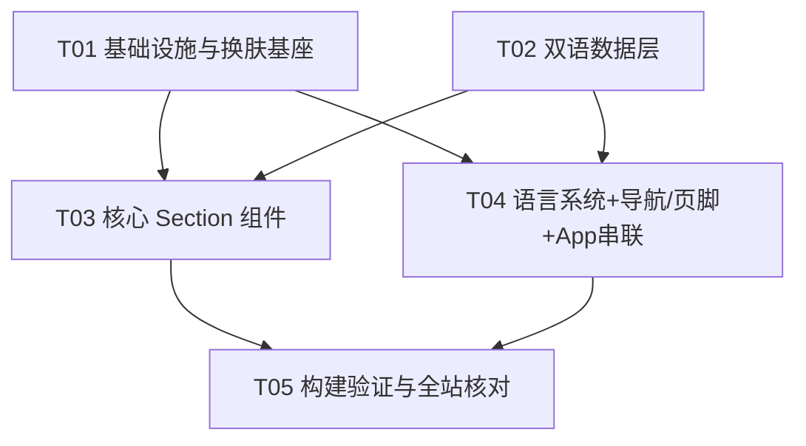

# Amber River 双语作品集 · 系统架构设计 + 任务分解

> **作者**：架构师 高见远（software-architect）
> **改造起点**：gerenzhan 克隆（crimson 配色、7 板块、纯中文）
> **目标**：逐字重建 `aystba-portfolio.pages.dev` 同款双语作品集（neon 绿 `#c8ff00` 配色、9 板块、EN/CN 双语）
> **技术栈**：Vite + React 18（自定义 CSS，**不引入** MUI / Tailwind / i18next）
> **配套决议**：PRD 已锁定决议（站主名 AYSTBA→Amber River、配色换肤、旧资产清理、Strengths 并入 Skills、截断词逐字保留）

---

## Part A：系统设计

### 1. 实现方案（Implementation Approach）

#### 1.1 技术难点

| # | 难点 | 对策 |
|---|------|------|
| 1 | **逐字双语还原**：9 板块 / 6 项目 / 服务·技能·开源·联系均需 EN/CN 双份逐字文案；站主名 AYSTBA→Amber River 在标题、Hero、「I am …」、`<title>` 多处统一替换 | 数据层统一 `{en, cn}` 双字段；`t(data[lang])` 取数；全站搜索替换 AYSTBA→Amber River |
| 2 | **配色整体换肤**：crimson 令牌整段替换为 aystba 实测 neon 绿令牌；同时保留并复用 cursor 跟随 conic 发光描边（`.glow-card`）与径向渐变背景（`.grain-bg-wrapper`） | `global.css` 令牌表整段替换；`.glow-card` / `.grain-bg-wrapper` / `.reveal` 实现原样保留 |
| 3 | **旧资产清理 + 视觉替换**：删除 gerenzhan 视频/图片，Hero 与项目卡改用纯 CSS 渐变/粒子占位（无外部图） | 删除 `public/assets/*` 旧素材；新增 `BackgroundFX` 纯 CSS 背景；项目卡去 `img` |
| 4 | **i18n 自建**：不引 i18next，用 React Context 实现 lang 状态 + localStorage 持久化 + `t(data[lang])` 取数 | 新建 `LanguageProvider`（Context + `useLang`） |
| 5 | **板块重组**：SelectedWork→SelectedProjects（6 卡）、新增 Skills/Services/OpenSource、Strengths 并入 Skills、删 StrengthsSection | 改名 + 新建 + 合并，App 串联 9 板块 |

#### 1.2 框架与库选型

| 维度 | 选型 | 理由 |
|------|------|------|
| 构建 | Vite 5（既有） | 沿用，`base` 自适应 CF `/`、GH Pages `/blog/` |
| UI | React 18 + 自定义 CSS | 沿用现有工程，不引入 MUI/Tailwind（PRD 误述） |
| i18n | **React Context 自建** | 零依赖；仅需 lang 状态 + `t` 取数，i18next 过重 |
| 动画 | 纯 CSS + IntersectionObserver | glow-card / reveal / count-up 沿用，粒子/渐变纯 CSS |
| 图标 | 内置 `AppIcon`（SVG path） | 不引图标库 |

#### 1.3 架构模式

- **组件树 + 单一 Context（LanguageProvider）** 包裹全站；数据层（`src/data/*`）以 `{en, cn}` 双字段导出纯数据模块；组件为「展示型 + 少量交互（GlowCard / Reveal / 语言切换）」。
- **数据流单向**：`LanguageProvider` 提供 `lang` → 组件用 `t(data[lang])` 取文本；语言切换仅更新 Context，触发全站重渲染。
- **无后端、无路由库**：单页锚点导航 + `scroll-behavior: smooth` + `scroll-margin-top` 偏移。

---

### 2. 文件清单（File List）

#### 2.1 删除（gerenzhan 残留）

| 操作 | 相对路径 | 说明 |
|------|----------|------|
| 删除 | `public/assets/hero-background.mp4` | gerenzhan 视频素材，aystba 用 CSS 渐变/粒子 |
| 删除 | `public/assets/project-01.jpg` | gerenzhan 旧项目图 |
| 删除 | `public/assets/project-02.jpg` | gerenzhan 旧项目图 |
| 删除 | `public/assets/project-03.jpg` | gerenzhan 旧项目图 |
| 删除 | `src/components/StrengthsSection.jsx` | 并入 Skills，不再独立成板块 |
| 删除 | `src/data/capabilities.js` | 由 `skills.js` 取代 |
| 删除 | `src/data/nav.js` | 由 `i18n.js` 取代 |

#### 2.2 修改（复用 / 改名）

| 操作 | 相对路径 | 说明 |
|------|----------|------|
| 改+改名 | `src/components/SelectedWorkSection.jsx` → `src/components/SelectedProjectsSection.jsx` | 渲染 6 张逐字项目卡，CSS 占位媒体 |
| 修改 | `src/styles/global.css` | 令牌整段替换 + 保留 glow-card/grain-bg-wrapper/reveal + 新增各板块样式 + 各锚点 `scroll-margin-top` |
| 修改 | `src/App.jsx` | 串联 9 板块，外层包 `<LanguageProvider>` |
| 修改 | `src/components/SiteNav.jsx` | 加语言切换按钮 + 双语锚点（用 `i18n` + `useLang`） |
| 修改 | `src/components/SiteFooter.jsx` | 加语言 + 关于锚点（用 `i18n` + `useLang`） |
| 修改 | `src/components/HeroSection.jsx` | 双语 Hero + 删 video + CSS 渐变/粒子背景 + AYSTBA→Amber River |
| 修改 | `src/components/AboutSection.jsx` | 扩展 about-resume-* 结构，双语 |
| 修改 | `src/components/ContactSection.jsx` | 双语联系方式 |
| 修改 | `src/data/profile.js` | Amber River 身份/职业标签/个人经历/UPCHIS/深圳，{en,cn} |
| 修改 | `src/data/projects.js` | 6 个逐字项目，{en,cn}，去 img |
| 修改 | `index.html` | `<title>` → "Amber River — Designer & Creator" + 双语 description |
| 核验 | `vite.config.js` | 不改，确认 `base: process.env.BASE_URL \|\| '/'` |
| 核验 | `package.json` | 不新增依赖，可顺手更新 name/description |
| 可选 | `public/favicon.svg` | 可换 AR 标记（非必须） |

#### 2.3 新建

| 操作 | 相对路径 | 说明 |
|------|----------|------|
| 新建 | `src/context/LanguageProvider.jsx` | React Context + `useLang` + localStorage 持久化（默认 en） |
| 新建 | `src/data/skills.js` | 技能分类 + 技术栈 + 个人优势（合并 Strengths），{en,cn} |
| 新建 | `src/data/services.js` | 3 条服务方向，{en,cn} |
| 新建 | `src/data/i18n.js` | 站点级 UI 文案：切换按钮 + 板块标题 EN/CN + 导航锚点 |
| 新建 | `src/components/SkillsSection.jsx` | 技能 + 技术栈 + 个人优势合并展示 |
| 新建 | `src/components/ServicesSection.jsx` | 3 条服务方向卡片 |
| 新建 | `src/components/OpenSourceSection.jsx` | GitHub 开源贡献板块 |
| 新建 | `src/components/BackgroundFX.jsx` | Hero CSS 径向渐变 + 粒子 / `.grain-bg-wrapper` 背景（纯 CSS） |

#### 2.4 复用、不变

`src/main.jsx`、`src/utils.js`（`asset()` 保留）、`src/components/GlowCard.jsx`、`src/components/Reveal.jsx`、`src/components/AppIcon.jsx`、`public/favicon.svg`。

#### 2.5 架构师落盘（覆盖旧）

- `docs/system_design.md`（本文件）
- `docs/class-diagram.mermaid`
- `docs/sequence-diagram.mermaid`

---

### 3. 数据结构与接口（Data Structures and Interfaces）

> 仅定义**形状/字段与取数约定**，不写实现代码。所有文案值逐字来自 PRD §，由 T02 填充。

#### 3.1 数据层形状（TypeScript 风格伪代码）

```ts
type Bilingual = { en: string; cn: string }
type BilingualItem = { en: string; cn: string }

// profile.js —— 站主身份 / Hero / About / Contact
export const profile = {
  identity: { name: Bilingual; role: Bilingual; location: Bilingual }, // Amber River / Designer & Creator / 中国深圳
  hero: {
    greeting: Bilingual,        // "I am Amber River" / "我是 Amber River！"
    tags: BilingualItem[],      // Developer · Designer · Creator
  },
  about: {
    headline: Bilingual,
    paragraphs: Bilingual[],    // 个人经历/职业身份/自学 React Vue Python Rust/独立开发者起步2020/多次获奖/联合创始人/UPCHIS 数字创意工作室/位于中国深圳（逐字，含截断词）
    resume: { role: Bilingual; org: Bilingual; period: string; detail: Bilingual }[], // about-resume-* 结构（扩展）
  },
  contact: { email: string; phone: string; welcome: Bilingual }, // 邮箱/手机/欢迎语
}

// projects.js —— 6 个逐字项目（无 img，CSS 占位）
export const projects: {
  id: number
  title: Bilingual
  desc: Bilingual
  tags: BilingualItem[]
}[]   // 个人作品集网站 / 小米MiMo AI桌面客户端 / 加密套件 / 智能灵感管理工具 / 跨平台桌面应用 / 教育科技项目

// skills.js —— 技能分类 + 技术栈 + 个人优势
export const skills = {
  categories: { title: Bilingual; items: BilingualItem[] }[],
  techStack: { name: string; type: string }[],  // React·Vue·Python·Rust·Tauri（语言无关）
  strengths: { title: Bilingual; desc: Bilingual }[],  // 个人优势（并入）
}

// services.js —— 3 条服务方向
export const services: {
  id: number
  title: Bilingual
  desc: Bilingual
  icon: string   // AppIcon name
}[]   // 网页应用和桌面客户端 / 桌面客户端·AI工具链 / 教育科技

// i18n.js —— 站点级 UI 文案
export const i18n = {
  ui: { switchLabel: Bilingual },        // "切换到中文" / "Switch to English"
  nav: { brand: string; links: { key: string; label: Bilingual; href: string }[] },
  titles: {                              // 板块标题 EN/CN
    hero: Bilingual; about: Bilingual; projects: Bilingual;
    skills: Bilingual; services: Bilingual; opensource: Bilingual; contact: Bilingual
  },
  footer: { about: Bilingual },
}
```

#### 3.2 语言上下文接口

```ts
// src/context/LanguageProvider.jsx
type Lang = 'en' | 'cn'
interface LanguageContextValue {
  lang: Lang
  setLang(lang: Lang): void             // 写入 localStorage('lang')
  t(obj: Bilingual | undefined): string // obj?.[lang] ?? obj?.en
}
useLang(): LanguageContextValue         // 组件内取用
<LanguageProvider>{children}</LanguageProvider>  // 包裹全站，default lang='en'
```

#### 3.3 类图（classDiagram）

```mermaid
classDiagram
    class ProfileData {
        +identity: {name, role, location}
        +hero: {greeting, tags[]}
        +about: {headline, paragraphs[], resume[]}
        +contact: {email, phone, welcome}
    }
    class ProjectData {
        +id: number
        +title: Bilingual
        +desc: Bilingual
        +tags: BilingualItem[]
    }
    class SkillsData {
        +categories: [{title, items[]}]
        +techStack: [{name, type}]
        +strengths: [{title, desc}]
    }
    class ServicesData {
        +id: number
        +title: Bilingual
        +desc: Bilingual
        +icon: string
    }
    class I18nData {
        +ui: {switchLabel}
        +nav: {brand, links[]}
        +titles: {hero, about, projects, skills, services, opensource, contact}
        +footer: {about}
    }
    class LanguageContext {
        +lang: 'en' | 'cn'
        +setLang(lang)
        +t(obj): string
    }
    class LanguageProvider {
        +children: ReactNode
        +useLang(): LanguageContext
    }
    LanguageProvider ..> LanguageContext : provides
    class App { +render(): 9 sections }
    class SiteNav { +onToggleLang() }
    class SiteFooter { +onToggleLang() }
    class HeroSection
    class AboutSection
    class SelectedProjectsSection
    class SkillsSection
    class ServicesSection
    class OpenSourceSection
    class ContactSection
    class BackgroundFX
    class GlowCard
    class Reveal
    class AppIcon
    App *-- SiteNav
    App *-- HeroSection
    App *-- AboutSection
    App *-- SelectedProjectsSection
    App *-- SkillsSection
    App *-- ServicesSection
    App *-- OpenSourceSection
    App *-- ContactSection
    App *-- SiteFooter
    App ..> LanguageProvider : wraps
    SiteNav ..> LanguageContext : useLang()
    SiteFooter ..> LanguageContext : useLang()
    SiteNav ..> I18nData : nav + ui
    SiteFooter ..> I18nData : footer + ui
    HeroSection ..> ProfileData : hero/identity
    HeroSection ..> BackgroundFX : CSS gradient/particle
    AboutSection ..> ProfileData : about
    SelectedProjectsSection ..> ProjectData
    SkillsSection ..> SkillsData
    ServicesSection ..> ServicesData
    OpenSourceSection ..> I18nData : opensource
    ContactSection ..> ProfileData : email/phone
    ContactSection ..> I18nData : contact
    SelectedProjectsSection ..> GlowCard
    SkillsSection ..> GlowCard
    ServicesSection ..> GlowCard
    AboutSection ..> GlowCard
    HeroSection ..> Reveal
    AboutSection ..> Reveal
```

---

### 4. 程序调用流程（Program Call Flow）

#### 4.1 初始挂载 + 语言切换 + 锚点跳转



#### 4.2 关键调用说明

- **初始化**：`main.jsx` 渲染 `<App/>`；`<App/>` 顶层包 `<LanguageProvider>`，Provider 挂载时从 `localStorage('lang')` 读取（缺省 `'en'`）。
- **数据获取**：每个 Section 调 `const { lang, t } = useLang()`，再 `t(profile.hero.greeting)` 等取对应语言文本（`lang ∈ {en, cn}`）。
- **语言切换**：`SiteNav` 切换按钮调 `setLang('cn')` → 写 `localStorage` → Context 变更 → 全站组件以 `{cn}` 重渲染。
- **锚点跳转**：`SiteNav.go(href)` 阻止默认跳变，`scrollIntoView({behavior:'smooth'})`，配合 CSS `scroll-margin-top` 抵消固定导航 64px。

---

### 5. 待明确事项（Anything UNCLEAR）

1. **外部图片**：aystba 真实站实测仅 CSS 渐变/粒子，判断无外部图，项目卡 / Hero 用 CSS 占位；若后续需真实封面，再在 `public/covers/` 放图并走 `asset()`（当前目录已确认无残留）。
2. **`<title>`**：已按锁定决议改为 **"Amber River — Designer & Creator"**。
3. **服务方向拆分**：PRD 原文「网页应用和桌面客户端/桌面客户端·AI工具链·教育科技」语义含 3–4 项，按锁定决议定为 **3 条**服务方向，具体逐字切分由 T02 数据层依 PRD 落定。
4. **UPCHIS / MiMo / moX / danci007**：为工作室/项目名，非本名，**保留不改**；仅站主名 AYSTBA→Amber River。
5. **截断词**（「等。」「等」）逐字保留，不补全。
6. **favicon**：可选更新为 "AR" 标记，非阻塞。
7. **SkillsSection 布局**：技能分类 + 技术栈（React·Vue·Python·Rust·Tauri）+ 个人优势（合并 Strengths）三者并排/分段展示，具体栅格由 T03 在实现时依令牌定。

---

## Part B：任务分解（Task Decomposition）

### 6. 依赖包（Required Packages）

**零新增依赖。** 既有：`react@^18.3.1`、`react-dom@^18.3.1`、`vite@^5.2.11`、`@vitejs/plugin-react@^4.3.1`。

明确**不引入**：MUI、Tailwind、i18next、图标库、动画库。i18n 用 React Context 自建；粒子/渐变用纯 CSS。

---

### 7. 任务列表（有序、含依赖，≤5 模块级）

#### T01 — 基础设施与换肤基座 ｜ 优先级 P0 ｜ 依赖：无

- **源文件**：
  - `public/assets/hero-background.mp4`（删除）
  - `public/assets/project-01.jpg`（删除）
  - `public/assets/project-02.jpg`（删除）
  - `public/assets/project-03.jpg`（删除）
  - `src/styles/global.css`（修改：令牌整段替换为 aystba neon 绿；保留 `.glow-card` / `.grain-bg-wrapper` / `.reveal`；新增 nav/hero/about/selected-projects/skills/services/opensource/contact/footer 样式；各锚点 `scroll-margin-top`）
  - `index.html`（修改：`<title>`→"Amber River — Designer & Creator" + 双语 meta description）
  - `vite.config.js` / `package.json`（核验：base 不变、依赖不变）
- **产出**：换肤后的底座样式 + 已清理的旧资产 + 正确 `<title>`。

#### T02 — 双语数据层（逐字 {en,cn}） ｜ 优先级 P0 ｜ 依赖：无

- **源文件**：
  - `src/data/profile.js`（修改：Amber River 身份/Hero/About/Contact，{en,cn}）
  - `src/data/projects.js`（修改：6 个逐字项目，{en,cn}，去 img）
  - `src/data/skills.js`（新建：技能分类 + 技术栈 + 个人优势，{en,cn}）
  - `src/data/services.js`（新建：3 条服务方向，{en,cn}）
  - `src/data/i18n.js`（新建：切换按钮 + 板块标题 EN/CN + 导航锚点）
  - `src/data/capabilities.js`（删除）
  - `src/data/nav.js`（删除）
- **产出**：全站逐字双语数据源，站主名统一 Amber River。

#### T03 — 核心 Section 组件 ｜ 优先级 P0 ｜ 依赖：T01, T02

- **源文件**：
  - `src/components/SelectedProjectsSection.jsx`（改+改名自 SelectedWorkSection：6 卡，CSS 占位媒体）
  - `src/components/HeroSection.jsx`（修改：双语 Hero + 删 video + CSS 渐变/粒子 + AYSTBA→Amber River）
  - `src/components/AboutSection.jsx`（修改：扩展 about-resume-* 结构，双语）
  - `src/components/ContactSection.jsx`（修改：双语联系方式）
  - `src/components/SkillsSection.jsx`（新建：技能 + 技术栈 + 个人优势合并）
  - `src/components/ServicesSection.jsx`（新建：3 条服务方向）
  - `src/components/OpenSourceSection.jsx`（新建：GitHub 开源贡献）
  - `src/components/BackgroundFX.jsx`（新建：Hero CSS 渐变/粒子背景）
- **产出**：9 板块中除导航/页脚外的 7 个内容板块组件。

#### T04 — 语言系统 + 导航/页脚 + App 串联 ｜ 优先级 P0 ｜ 依赖：T01, T02

- **源文件**：
  - `src/context/LanguageProvider.jsx`（新建：Context + `useLang` + localStorage 持久化，默认 en）
  - `src/components/SiteNav.jsx`（修改：语言切换按钮 + 双语锚点）
  - `src/components/SiteFooter.jsx`（修改：语言 + 关于锚点）
  - `src/App.jsx`（修改：串联 9 板块，外层包 `<LanguageProvider>`）
- **产出**：i18n 能力就绪 + 导航/页脚双语 + 全站装配完成。

#### T05 — 构建验证与全站核对 ｜ 优先级 P1 ｜ 依赖：T03, T04

- **源文件/动作**：
  - `src/App.jsx`（最终集成核对）
  - `index.html`（`<title>` 与 description 核对）
  - `package.json` / `vite.config.js`（构建脚本与 base 核对）
  - `public/covers/`（确认无残留；`public/assets/` 旧素材已删）
  - 执行 `npm run build` 与 `npm run dev`：验证 i18n 默认英文、AYSTBA→Amber River 全站一致、双语切换、锚点 smooth 偏移、纯 CSS 背景无外部图 404。
- **产出**：可部署构建 + 全站核对清单通过。

---

### 8. 共享知识（Shared Knowledge）

- **取数约定**：`const t = (o) => o?.[lang] ?? o?.en`；组件统一 `const { lang, t } = useLang()` 后 `t(data[lang])` 取文本（`lang ∈ {en, cn}`）。
- **站主名统一**：全站 `AYSTBA` → `Amber River`（标题、Hero、「I am …」、`<title>`）。`UPCHIS` / `MiMo` / `moX` / `danci007` 保留不改。
- **`asset()` 仍可用**：本次无外部图，渐变/粒子用纯 CSS；若日后加封面仍走 `asset()` 拼接 BASE_URL，避免子路径 404。
- **锚点**：`scroll-behavior: smooth` + 各区块 `scroll-margin-top`（抵消固定导航 64px），`SiteNav.go()` 用 `scrollIntoView` 平滑跳转。
- **截断词逐字保留**（「等。」「等」不补全）。
- **语言持久化**：`localStorage('lang')`，默认 `'en'`；切换按钮文案随当前 lang 反向显示（en 时显示「切换到中文」，cn 时显示 "Switch to English"）。
- **复用机制**：`.glow-card`（cursor 跟随 conic 发光描边，变量 `--cursor-angle` / `--edge-proximity` / `--edge-sensitivity` / `--cone-spread` / `--glow-padding`）、`.grain-bg-wrapper`（径向渐变背景）、`.reveal`（IntersectionObserver 淡入）保持原实现不变。

---

### 9. 任务依赖图（Task Dependency Graph）



> 结构说明：T01（换肤底座）与 T02（双语数据）为两条并行根任务；T03（内容板块）与 T04（语言+导航+装配）并行依赖前两者；T05（验证）汇总前两者后执行。线性链最长 3 跳，符合模块级拆分约束。
